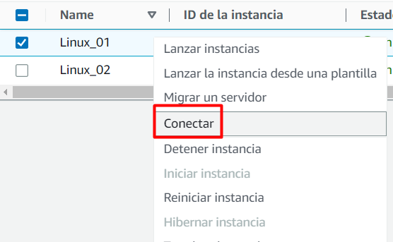
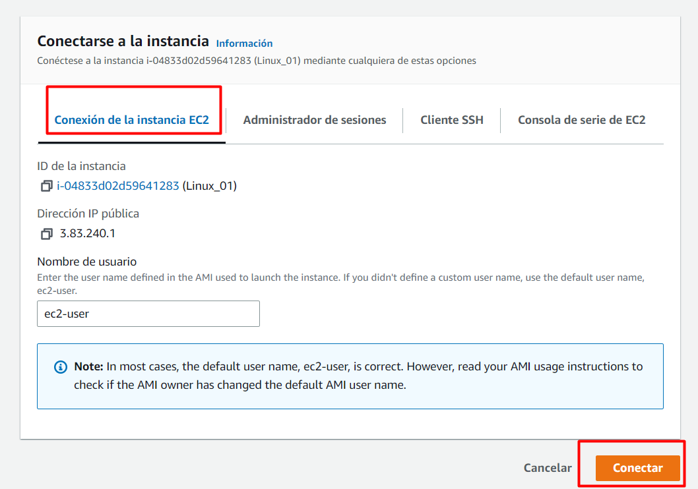
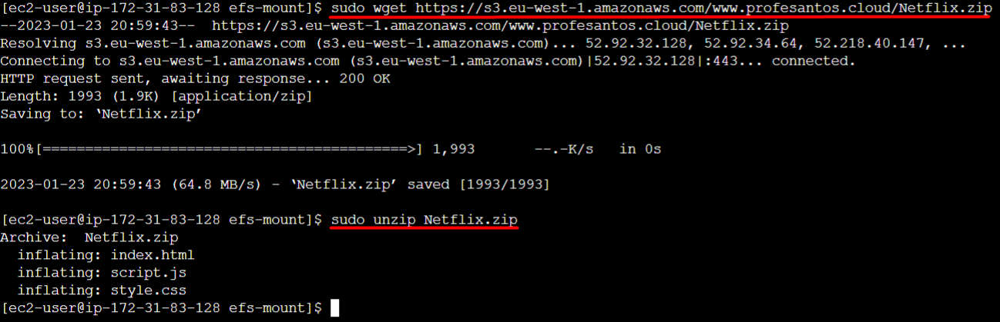
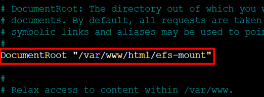

# Práctica 4.3 GBD Despliegue de una arquitectura EFS-EC2-MultiAZ
En primer lugar creamos un grupo de seguridad que lo llamaremos SGweb en el que abriremos el puerto 80 para el servicio http y otro grupo de seguridad llamado SGefs en el que abriremos el puerto 2049 para el NFS:

En el grupo de seguridad SGefs solo podrán acceder los equipos que estén dentro del grupo de seguridad SGweb.

Ahora lanzamos una instancia EC2 con sistema operativo amazon linux con par de claves vockey y con el grupo de seguridad SGweb, con subnet en la zona us-east-1a y que nos asigne una ip pública. 

Por último en datos de usuario al final del todo, copiaremos los siguientes comandos para inrtalar caracteristicas a la maquina:

Y lanzamos la instancia.

Creamos otra EC2 igual a la anterior pero con la subnet en la zona us-east-1b

y los datos de usuario, igual a la maquina anterior:

Y lanzamos la instancia.

Nos vamos al grupo de seguridad SGweb y abrimos el puerto ssh para poder conectarnos a la instancia via ssh 

Creamos un sistema de ficheros EFS el cual nos cobrará amazon por usarlo pero es una cantidad muy pequeña ya que no habra mucha información dentro de el:

 cuando tengamos el sistema de ficheros creado, entramos a editar la red y en las zonas que hemos usado en las maquinas EC2 que han sido us-east-1a y 1b, le cambiamos el grupo de seguridad al que creamos anteriormente, SGefs.
 
 

 Nos conectamos a las instancias EC2 creadas:
 
 
 

 Cando nos inicie el command prompt de la primera EC2 creamos una carpeta dentro de /var/www/html llamada efs-mount:
 
Y montaremos el sistema de ficheros dentro de la carpeta que hemos creado con el siguiente comando:

Cambiando el Id por el de nuestro sistema EFS.

Entramos en la carpeta efs-mount y realizamos un wget para descargarnos el .zip de la pagina web desde internet.

Cuando tengamos la pagina descargada descomprimimos el fichero descargado.

Para que al buscar la ip en internet nos salga directamente la pagina web, debemos cambiar la ruta dentro del fichero /etc/httpd/confd/hhtpd.conf

Cambiamos la ruta que hay en Documentroot por la de la carpeta efs-mount:

Y reiniciamos el servicio http:

Y al introducir la ip en el navegador nos saldrá directamente la pagina web:

<b>TODOS LOS PASOS REALIZAMOS DESDE EL COMMAND PROMPT, SE REALIZARAN DE IGUAL MANERA EN LA SEGUNDA EC2</b>